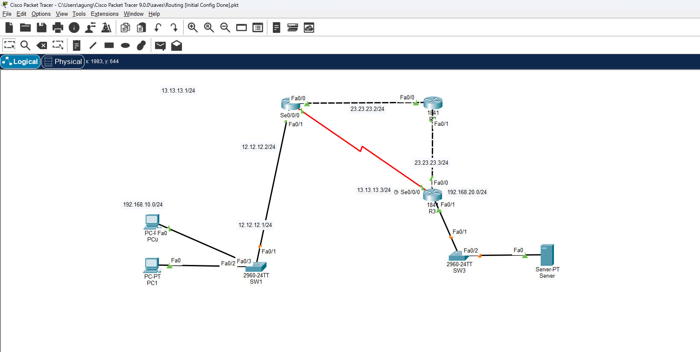
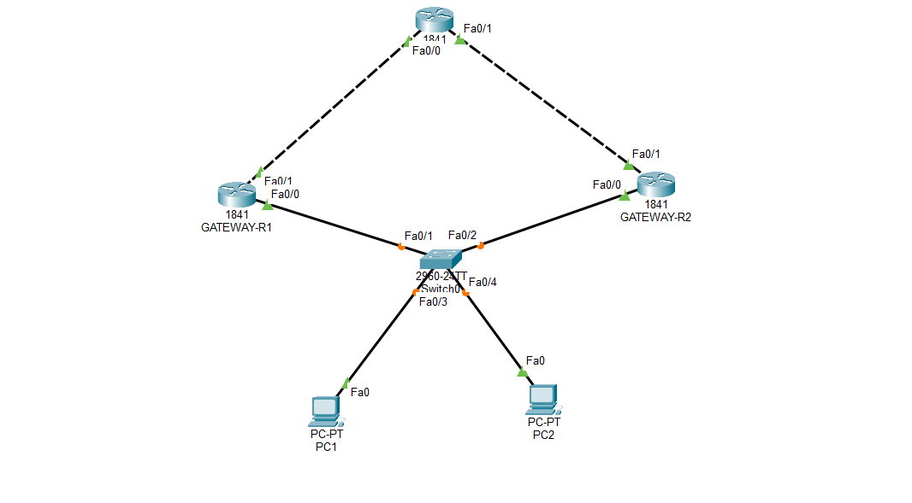

Ketika jaringan lokal sudah berdiri, saatnya menghubungkannya melintasi multi-hop router. Domain **IP Connectivity** adalah jantung dari komunikasi lintas jaringan.

### Membaca Routing Table & Keputusan Forwarding
Router menentukan arah paket berdasarkan isi tabel routing. Kita mempelajari komponen penting di dalamnya: protokol routing code, prefix, network mask, next-hop, *Administrative Distance (AD)*, metric, hingga *Gateway of Last Resort*. Saat meneruskan paket, router menggunakan algoritma **Longest Prefix Match**, AD, dan *metric* terbaik.

### Static Routing & OSPFv2
Kita mengonfigurasi **IPv4 dan IPv6 static routing** (mulai dari default route, network/host route, hingga *floating static route* sebagai jalur cadangan). Untuk otomatisasi skala besar, kita mengimplementasikan **Single Area OSPFv2**:
* Mengatur *neighbor adjacencies*.

* Membedakan tipe jaringan OSPF (*broadcast* vs *point-to-point* di serial link WAN) serta menentukan *Router ID*.

### High Availability (FHRP & HSRP)
Agar jaringan tidak mengalami *Single Point of Failure*, kita mempelajari konsep **First Hop Redundancy Protocol (FHRP)** dan menerapkannya lewat **HSRP (Hot Standby Router Protocol)**.

Dua router digabungkan dengan satu *Virtual IP* (VIP) sehingga klien aman dari downtime saat terjadi kegagalan perangkat.