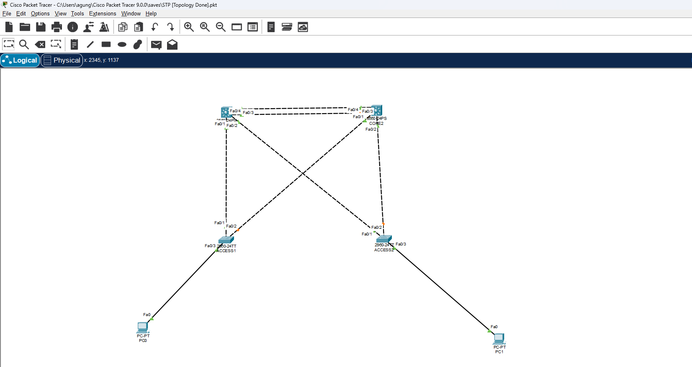

Di ranah **Network Access**, fokus utamanya adalah bagaimana perangkat dalam satu jaringan lokal (LAN) saling bertukar *frame* secara efisien, terisolasi, dan aman dari gangguan fisik maupun logis.

### VLAN & Trunking (802.1Q)
Untuk memecah *broadcast domain* di satu switch fisik, kita menggunakan **VLAN (Virtual Local Area Network) range normal**. 
* **Access Port:** Didedikasikan untuk satu VLAN khusus endpoint/PC.
* **Trunk Port:** Jalur penghubung antar switch yang membawa banyak trafik VLAN menggunakan penandaan standar IEEE 802.1Q, termasuk pengaturan *Native VLAN*.

### Spanning Tree Protocol (STP) & Layer 2 Security
Redundansi kabel sangat penting, tapi jalur fisik melingkar bisa memicu *Broadcast Storm*. Di sinilah **Rapid PVST+** bekerja otomatis mengatur pemilihan *Root Bridge* (Primary/Secondary), menentukan *Port Roles* (*Root Port, Designated Port*), serta memonitor *Port States*.

Untuk menjaga stabilitas, kita juga mengaktifkan fitur pengaman seperti **Portfast, Root Guard, Loop Guard, BPDU Filter, dan BPDU Guard**. Tak lupa, **Port Security** diterapkan untuk membatasi MAC address yang boleh terhubung ke port switch.

### EtherChannel (LACP) & Discovery Protocols
Guna meningkatkan kapasitas *bandwidth* dan redundansi tanpa memicu *loop* STP, kita mengonfigurasi **EtherChannel** menggunakan protokol terbuka **LACP (Link Aggregation Control Protocol)** di mode Layer 2 maupun Layer 3. Serta menggunakan **CDP dan LLDP** untuk memetakan informasi perangkat tetangga secara transparan.